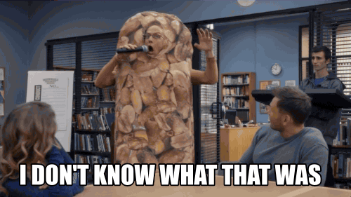

# `ort-with-claude`


Learning [`ort`](https://ort.pyke.io) by running two structurally different
inference tasks — token classification (NER) and multimodal embeddings (CLIP) —
through the same set of tools, to find out which parts transfer between domains
and which don't.

See [`log.md`](./log.md) for the running notes.

## Getting the models

Model artefacts live in `onnx/`, which is gitignored. Fetch them by hand.

### `bert-base-NER` (Phase 1)

```sh
mkdir -p onnx/bert-base-NER && cd onnx/bert-base-NER
base=https://huggingface.co/Xenova/bert-base-NER/resolve/main
curl -L -o model.onnx     "$base/onnx/model.onnx"    # 412M, fp32
curl -L -o tokenizer.json "$base/tokenizer.json"
curl -L -o config.json    "$base/config.json"
```

`Xenova/bert-base-NER` is an ONNX re-export of `dslim/bert-base-NER`. The repo
also ships int8/fp16/q4 quantized variants under `onnx/`; we deliberately use
the fp32 `model.onnx` so that unexpected outputs are never ambiguous between
"my bug" and "quantization noise".

Three files, three separable concerns:

| file             | what it carries                                   | why the others can't                                                |
| ---------------- | ------------------------------------------------- | ------------------------------------------------------------------- |
| `model.onnx`     | the weights and the dataflow graph                | knows nothing about text or labels — just `int64` in, `float32` out |
| `tokenizer.json` | the full text→ids pipeline, incl. offset tracking | not recoverable from the graph                                      |
| `config.json`    | `id2label`, so logit index 3 means `B-PER`        | ONNX carries no label vocabulary                                    |
